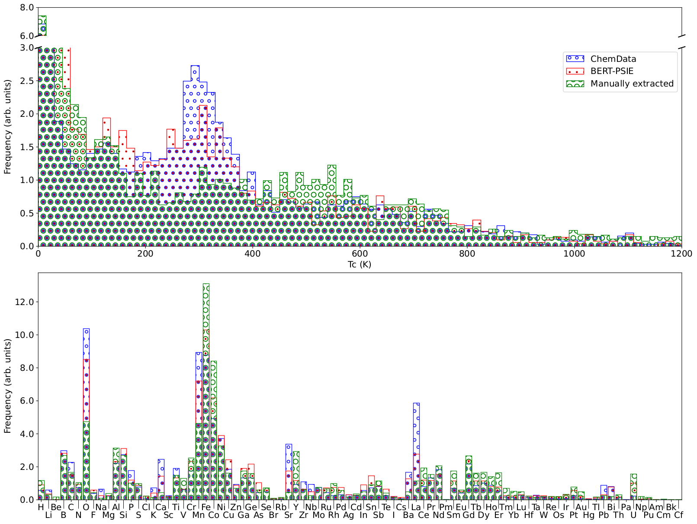
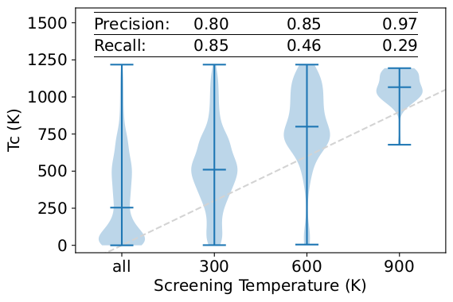

# BERT-PSIE-TC
A dataset of Curie temperatures automatically extracted from scientific literature with the use of BERT-PSIE.

The BERT-PSIE pipeline presented in:

> add arxiv paper link

consists of a series of BERT models fine-tuned on different downstream tasks for the automated extraction of data from scientific literature:
|  |
|:--:|
|   Schematic diagram of the BERT-PSIE pipeline for the automated extraction of compound-property pairs from scientific literature. The workflow relies on the combination of BERT models fine-tuned for different downstream tasks such as sentence classification, named entity recognition and relation classification.  |

Here we provide the dataset of Curie Temperatures automatically extracted by BERT-PSIE (Tc_dataset.csv). We chose this task so that we could compare the extraction performance against a manually curated dataset (expanded from [1]) and a dataset of Curie Temperatures automatically extracted with rule-based methods [2]. 

|  |
|:--:|
|  Comparison between the content of three different databases: (red box) BERT-PSIE (provided here), (blue box) ChemDataExtractor [1] and (green box) the manually-extracted database of Ref. [2]. Top panel: Normalized distribution of the Curie temperatures extracted. A peak is visible in the distribution around 300 K in both the autonomously extracted databases, which is not seen in the manually extracted one. Bottom panel: Relative elemental abundance across the compounds present in a database. Although there is general agreement among the three databases, additional peaks are observed for various elements in the case of automatically extracted data, which are not present in the manually curated dataset. The most severe of these discrepancies is in the relative abundance of Mn- and O-containing compounds. Note that the automatically extracted datasets and the manually curated one are based on different literature librarie.  |

The script train_RF.py trains a random forest predictor for the Curie Temperature over the Tc dataset. The model can be used to screen ferroelettric candidates based on their predicted Curie temperature.

|  |
|:--:|
|  Violin plots showing the TC distributions of the compounds screened using a RF model trained on the BERT-PSIE data and compared with the manually extracted values (top panel). The dashed line is the parity line highlighting how the median of the screened distribution increases as the screening threshold increases. Despite a low recall, the precision is high enough to select compounds likely to have a TC higher than a given threshold. The screening is done on compounds not present in the training set of the RF. |

### References

[1] C. J. Court and J. M. Cole, Auto-generated materials database of Curie and Neel temperatures via semi-supervised relation-ship extraction, Sci. Data 5, 180111 (2018).

[2] J. Nelson and S. Sanvito, Predicting the curie temperature of ferromagnets using machine learning, Phys. Rev. Materials 3, 104405 (2019).
